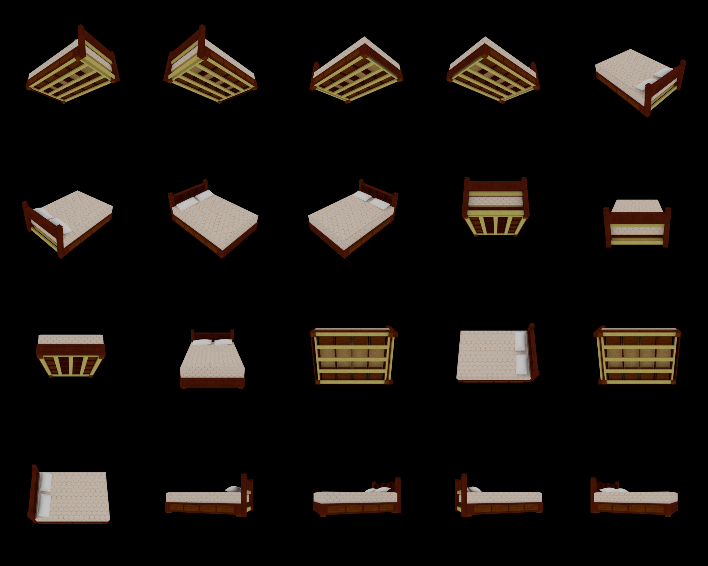
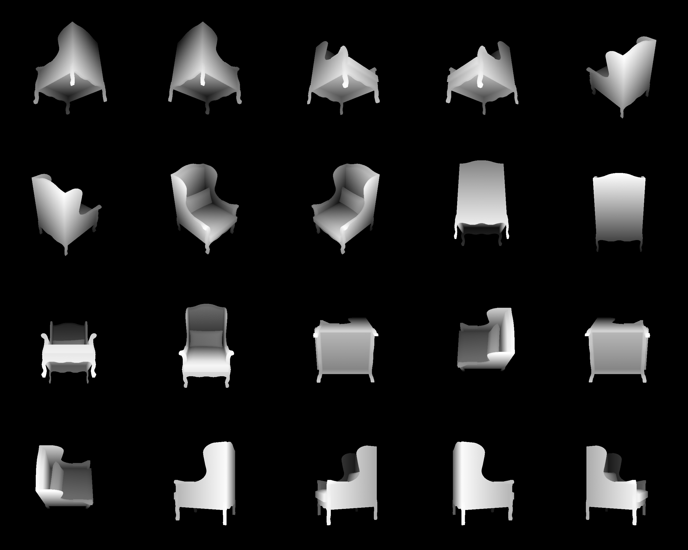
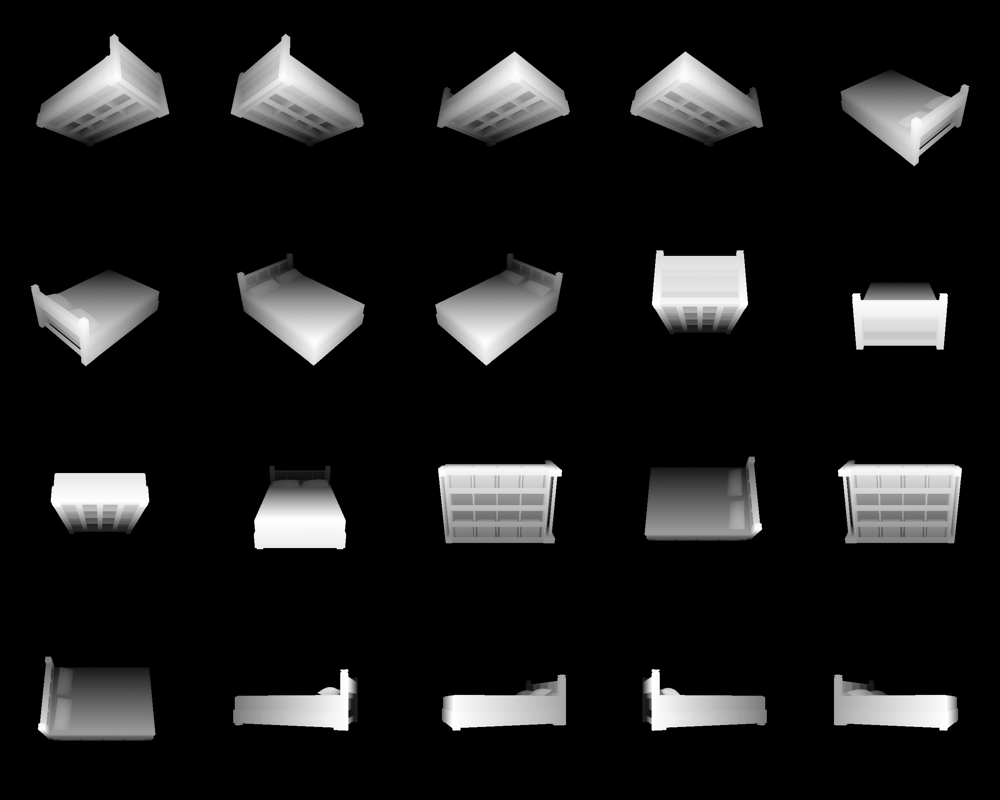
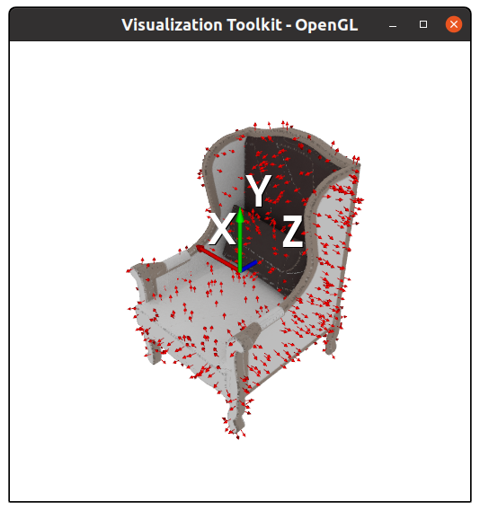
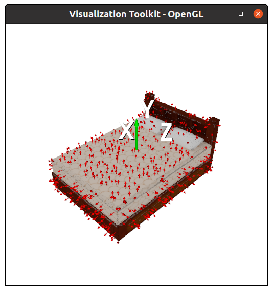
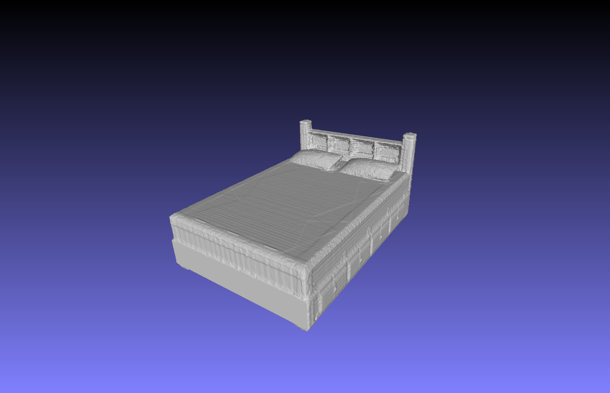

## Color & Depth Renderer for ShapeNet

---
This library includes the tools for rendering multi-view color and depth images of ShapeNet models. Physically based rendering (PBR) is featured based on [blender2.79](https://download.blender.org/release/Blender2.79/).

---
### Outputs
1. Color image (20 views)

 

2. Depth image (20 views)

 

3. Point cloud and normals (Back-projected from color & depth images)

 

4. Watertight meshes (fused from depth maps)

 

---
### Install
1. We recommend to install this repository with [conda](https://docs.conda.io/en/latest/miniconda.html).
    ```angular2html
    conda env create -f environment.yml
    conda activate renderer
    ```
2. Install [Pyfusion](https://github.com/yinyunie/pyfusion) by
    ```angular2html
    cd ./external/pyfusion
    mkdir build
    cd ./build
    cmake ..
    make
    ```
   Afterwards, compile the Cython code in ``./external/pyfusion`` by
    ```angular2html
    cd ./external/pyfusion
    python setup.py build_ext --inplace
    ```
3. Download & Extract [blender2.79b](https://download.blender.org/release/Blender2.79/), and specify the path of your blender executable file at ``./setting.py`` by
   ```angular2html
   g_blender_excutable_path = '../../blender-2.79b-linux-glibc219-x86_64/blender'
   ```

---
### Usage
1. Normalize ShapeNet models to a unit cube by
   ```angular2html
   python normalize_shape.py
   ```
   The ShapeNetCore.v2 dataset is put in ``./datasets/ShapeNetCore.v2``. Here we only present some samples in this repository.

2. Generate multiple camera viewpoints for rendering by
   ```angular2html
   python create_viewpoints.py
   ```
   The camera extrinsic parameters will be saved at ``./view_points.txt``, or you can customize it in this script.

3. Run renderer to render color and depth images by
   ```angular2html
   python run_render.py
   ```
   The rendered images are saved in ``./datasets/ShapeNetRenderings``. The camera intrinsic and extrinsic parameters are saved in ``./datasets/camera_settings``. You can change the rendering configurations at ``./settings.py``, e.g. image sizes and resolution.
4. The back-projected point cloud and corresponding normals can be visualized by
   ```angular2html
   python visualization/draw_pc_from_depth.py
   ```
5. Watertight meshes can be obtained by
   ```angular2html
   python depth_fusion.py
   ```
   The reconstructed meshes are saved in ``./datasets/ShapeNetCore.v2_watertight``
   

---

### Citation
This library is used for data preprocessing in our work [SK-PCN](https://papers.nips.cc/paper/2020/file/ba036d228858d76fb89189853a5503bd-Paper.pdf). If you find it helpful, please consider citing
```
@inproceedings{NEURIPS2020_ba036d22,
 author = {Nie, Yinyu and Lin, Yiqun and Han, Xiaoguang and Guo, Shihui and Chang, Jian and Cui, Shuguang and Zhang, Jian.J},
 booktitle = {Advances in Neural Information Processing Systems},
 editor = {H. Larochelle and M. Ranzato and R. Hadsell and M. F. Balcan and H. Lin},
 pages = {16119--16130},
 publisher = {Curran Associates, Inc.},
 title = {Skeleton-bridged Point Completion: From Global Inference to Local Adjustment},
 url = {https://proceedings.neurips.cc/paper/2020/file/ba036d228858d76fb89189853a5503bd-Paper.pdf},
 volume = {33},
 year = {2020}
}

```

---

### License
This repository is relased under the [MIT License](https://github.com/yinyunie/depth_renderer/blob/main/LICENSE).


